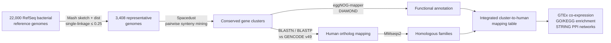

# Bactgen2Humgen

**A reproducible analysis pipeline linking conserved bacterial gene clusters to human homologous genes through synteny mining and multi-dimensional functional validation.**

🌐 Web resource: <https://bactgen2humgen.nh.ac.cn>

---

## Overview

Bacteria and eukaryotes have exchanged genetic material throughout evolution, yet systematic resources linking conserved bacterial gene clusters to their human homologs remain lacking. **Bactgen2Humgen** fills this gap by integrating:

1. **Synteny-based mining** of conserved bacterial gene clusters with [Spacedust](https://github.com/soedinglab/spacedust)
2. **Systematic mapping** of every cluster gene to the human transcriptome and proteome ([GENCODE v49](https://www.gencodegenes.org/)) by combined BLASTN + BLASTP, complemented by [eggNOG-mapper](https://github.com/eggnogdb/eggnog-mapper) annotation and [MMseqs2](https://github.com/soedinglab/MMseqs2) homologous-family grouping
3. **Multi-dimensional functional validation** of the resulting human ortholog modules — GTEx co-expression, GO/KEGG enrichment, and STRING protein–protein interaction networks

All pipeline stages are orchestrated as reproducible [Nextflow](https://www.nextflow.io/) workflows.

### Key numbers (as described in the manuscript)

| Item | Value |
|---|---|
| NCBI RefSeq bacterial reference genomes | 22,000 |
| Non-redundant representative genomes (Mash distance ≤ 0.25) | 3,408 |
| Genera / families retained after deredundancy | 2,211 / 697 |
| Conserved-cluster mining | pairwise synteny search across 2,211 genera |

## Pipeline overview



## Repository structure

This repository contains the three analysis modules of Bactgen2Humgen:

```
.
├── select_bacteria_script/   # Module 0 — genome deredundancy (Mash)
├── cluster_script/           # Module 1 — conserved cluster mining & human mapping
└── downstream_script/        # Module 2 — per-cluster downstream workflows
```

### 1. `select_bacteria_script/` — Genome redundancy reduction

Reduces the NCBI RefSeq bacterial reference panel to a non-redundant, taxonomically representative set.

| Script | Function |
|---|---|
| `1-extract_accession_noacc.py` | Extract accession list from the NCBI assembly summary |
| `2.1-build_index.sh` / `2.2-link_genomes.sh` | Build the flat genome directory and links (`fna.gz`) |
| `3.1-rmash_sketch.sh` / `3.2-rmash_dist.sh` | `mash sketch` (k = 21, s = 10,000) and all-against-all `mash dist` |
| `3.3-select_representative_multi.py` | Parallel single-linkage clustering on pairwise distance ≤ 0.25 (BFS over a boolean adjacency matrix); the genome with the largest total sequence length is kept as representative |
| `4-cp_link.sh` / `5-cp_link2use.sh` | Copy/link representative genomes for downstream use |
| `6-stat_level.sh` / `7-stat_level_rep.sh` | Taxonomic profiling of the panel (taxonkit lineage/reformat) |

**Output:** representative genome list + cluster information table (cluster ID, representative, member count, member list).

### 2. `cluster_script/` — Conserved cluster mining & mapping to human genes

Main pipeline (`bactgen2humgen.nf`, Nextflow DSL2):

```
nextflow run bactgen2humgen.nf --query_genome <GCF_ID> \
    --input_dir <work_dir> --fna_dir <fna> --gff_dir <gff> \
    --output_dir <out> --run_blast --run_eggnog --run_mmseqs \
    --homo_pattern strict
```

| Stage | Scripts | Function |
|---|---|---|
| Pre-processing | `1correct_gff.sh`, `2.3correct_gff.sh` | Fix strand annotation of first/mis-start CDS entries in RefSeq GFFs |
| Gene prediction | `2.2run_prodigal.sh` | [Prodigal](https://github.com/hyattpd/Prodigal) `-p single` for genomes with missing/failed annotation |
| CDS extraction | `3extract_gene.sh`, `3extract_gene_single.sh` | Extract CDS nucleotide sequences per genome (GNU parallel) |
| Spacedust DB | `2.1/2.4create_spacedust_db.sh` | Build per-genome set databases for `spacedust clustersearch` |
| Cluster mining | `5.1–5.4`, `6run_task.sh` + `script/3spacedust_result/` | Dispatch 3,408 × 3,407 directed query–target pairwise searches; sort results; per-gene occurrence statistics |
| Conserved-cluster extraction | `script/3spacedust_result/4.1–4.3extract_cluster_*.py` | Signature-based extraction (`strict` / `median` / `sensitive` modes): signatures of ≥ 2 genes recurring in ≥ 2 genomes, greedy subset de-duplication → `Conserved_NNN` clusters |
| Human mapping | `script/6blast_human_gene/` | BLASTN vs GENCODE transcripts and BLASTP vs GENCODE proteins; hits reconciled under four strategies (best alignment length / E-value / percent identity / comprehensive rule); eggNOG-mapper (DIAMOND) annotation; provenance column (Both / BLAST only / eggNOG only) |
| Homologous families | `script/6blast_human_gene/7–9*` | MMseqs2 clustering of recruited human proteins; family map joined onto the mapping table |
| Integration | `script/8product_result.py` | Merge BLASTN + BLASTP + eggNOG on (cluster ID, gene) → `final_homogroup_results.csv` |

**Key output:** `gene2human/final_result/final_homogroup_results.csv` — per-cluster table of bacterial genes, human orthologs, alignment statistics, eggNOG annotations, and homologous-family membership.

### 3. `downstream_script/` — Per-cluster downstream workflows

Re-runnable, genome-oriented workflows for recomputing mapping and annotation for individual query genomes:

| File | Function |
|---|---|
| `bactgen4blast.nf` | Nextflow workflow: BLASTN/BLASTP mapping + MMseqs2 family grouping for a query genome |
| `bactgen4eggnog.nf` | Nextflow workflow: eggNOG annotation runs |
| `1.1-order_result.sh` / `1.2-batch_run.sh` / `2.1-order_cluster.sh` | Re-order Spacedust results and cluster tables |
| `3.1-extract_gene_withGID.py` / `3.2-run_strain.sh` / `3.3-batch_run.sh` | Extract cluster-gene sequences by gene ID (on-demand GFF parsing, gzip-aware) |
| `2.2-add_metainfo.sh` | Attach genome/species metadata |

> The `script/` sub-directories of `cluster_script/` and `downstream_script/` share the same core tool set (`3spacedust_result/`, `6blast_human_gene/`, `7eggNOG_anno/`, `8product_result.py`), called by both Nextflow workflows.

## Dependencies

| Software | Used for |
|---|---|
| [Nextflow](https://www.nextflow.io/) (≥ 22.x) | Workflow orchestration |
| [Mash](https://github.com/marbl/Mash) | Genome distance estimation / deredundancy |
| [Spacedust](https://github.com/soedinglab/spacedust) | De novo conserved gene-cluster discovery |
| [Prodigal](https://github.com/hyattpd/Prodigal) | Gene prediction |
| [BLAST+](https://ftp.ncbi.nlm.nih.gov/blast/executables/blast+/) (`makeblastdb`, `blastn`, `blastp`) | Human mapping |
| [eggNOG-mapper v2](https://github.com/eggnogdb/eggnog-mapper) + DIAMOND | Functional annotation |
| [MMseqs2](https://github.com/soedinglab/MMseqs2) | Homologous-family clustering |
| [GNU parallel](https://www.gnu.org/software/parallel/) | Massively parallel pairwise jobs |
| [taxonkit](https://github.com/shenwei356/taxonkit) | Taxonomic lineage profiling |
| Python 3 (numpy, etc.) | Result processing / integration |
| R (clusterProfiler, org.Hs.eg.db, STRINGdb, igraph) | Downstream validation (GTEx co-expression, GO/KEGG enrichment, STRING PPI) |

## Reference databases

The pipeline expects the following locally prepared databases (adjust paths in the workflow headers):

- **GENCODE v49** — `gencode.v49.pc_transcripts.fa` (BLASTN DB) and `gencode.v49.pc_translations.fa` (BLASTP DB)
- **eggNOG-mapper data** — eggnog-mapper database directory
- **GTEx v8** expression matrix (GCT, 17,382 samples) + sample annotations
- **STRING v11.5** (Homo sapiens, local database)

> ⚠️ **Note:** scripts contain hard-coded absolute paths (e.g. `/home/liuzhh/...`) from the original compute environment. Please update the path parameters at the top of each script and the `params.*` blocks in the Nextflow workflows before running.

## Web application

The pipeline results are exposed through an interactive web application ([FastAPI](https://fastapi.tiangolo.com/) backend + [Vue 3](https://vuejs.org/) frontend + SQLite), available at <https://bactgen2humgen.nh.ac.cn>:

- **Home** — database overview statistics
- **Browse** — species → conserved cluster catalog
- **Cluster detail** — on-demand execution of BLAST mapping, eggNOG annotation, cluster visualization, GTEx co-expression, GO/KEGG enrichment, and STRING PPI tools, managed by a serial job queue

## Citation

If you use Bactgen2Humgen, please cite:

> Bactgen2Humgen: a web resource linking conserved bacterial gene clusters to human homologous genes through synteny mining and multi-dimensional functional validation. *(manuscript in preparation)*

## License

[To be added]
